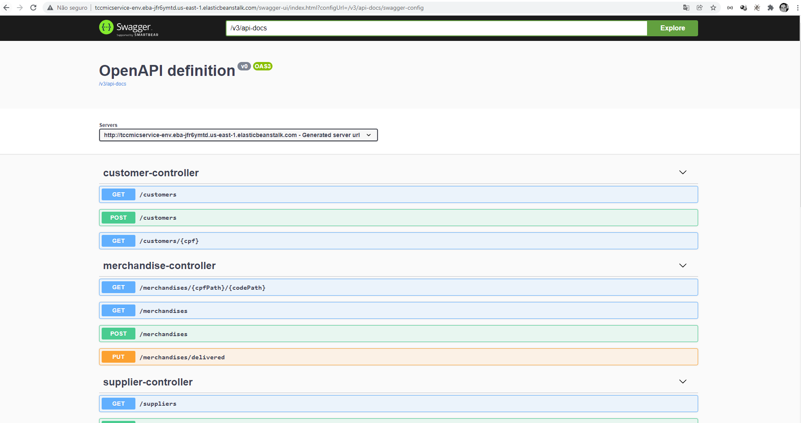

# Projeto mic-service

Projeto responsável por realizar todas as operações do Módulo de Informações Cadastrais (MIC).

Swagger:

#Para baixar as dependencias

mvn clean package

A collection para testes no POSTMAN está no arquivo tcc-mic-service.postman_collection na raiz do projeto